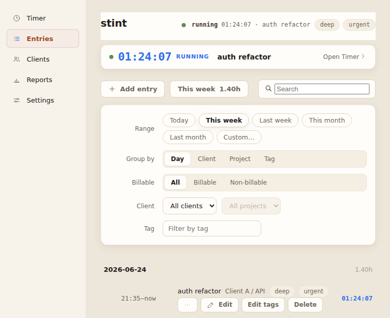
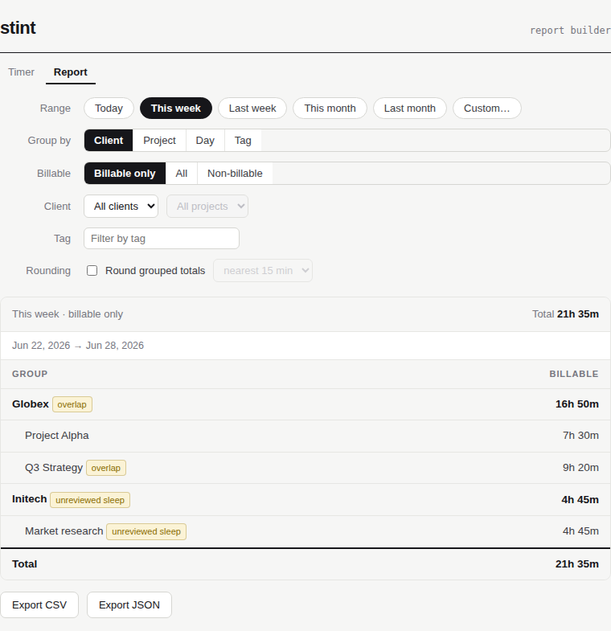

# Stint

A small, offline time tracker for one freelancer who bills by the hour. A tray
app and a `tt` command line are equal ways into one local SQLite file. The unit
is time; no money lives in the app.

## Using Stint

### Install

The easiest way in: download the latest Linux or macOS app from the
[releases page](https://github.com/kdbanman/stint/releases). Every merge to
`main` publishes a release, so it stays current.

To build from source instead, you need **Node ≥ 22.5** — persistence is the
built-in [`node:sqlite`](https://nodejs.org/api/sqlite.html), so there's no
native build step. The tray app needs Electron 35+ (its bundled Node must be
≥ 22.5); this repo pins Electron 42.

```sh
npm install
npm run build
npm run tt -- status     # or: node packages/cli/dist/bin.js status
```

Your data is one SQLite file: `$TT_DB` if set, otherwise the per-OS app-data
directory (`~/.local/share/stint/timetracker.sqlite` on Linux,
`~/Library/Application Support` on macOS, `%APPDATA%` on Windows). Both surfaces
use the same path. Backup is copying the file. No network, ever.

### The `tt` command line

```sh
tt start "auth refactor" --client "Client A" --project API --tag deep
tt status                       # ▸ running 01:24:07 · "auth refactor" · Client A / API
tt stop
tt add "spec review" --from 13:00 --to 14:30 --client "Client A"
tt list --week
tt report --week --by client --round 15
tt export --month --csv -o june.csv
tt sleep ls                     # entries the machine slept through
tt sleep subtract 42            # exclude slept time (reversible)
tt status --json                # --json on every read command, for scripting
```

Times accept absolute (`14:30`, `2026-06-24T14:30`) and relative (`-90m`,
`-1h30m`) forms. Read commands exit `0`; refusals and errors exit non-zero.

### The tray app

```sh
npm run gui     # needs an Electron binary (see Install)
```

A tray timer counts up; one click starts or stops. `Ctrl+Alt+T`
toggles it from anywhere. The main window groups the day's entries, shows flags
in context, and builds reports with CSV/JSON export. Anything the window does,
`tt` does too.





## Developing Stint

One core, one file, two thin shells. A single SQLite file in WAL mode; all reads
and writes go through `@stint/core`; each write is one `BEGIN IMMEDIATE`
transaction with a busy timeout, so the CLI and the running app cooperate.

The keystone idea: **a running timer is just the one entry whose `end` is null.**
"Running" is a row state, not a process, and elapsed time is always derived
(`now − start`), never stored. That's why both surfaces can drive the live timer
without coordinating — they read and write the same row.

### Layout

The repo is two halves, and the split is the whole point. The first is the
**specification** — the product and process requirements, plus the acceptance
criteria that say what must hold. The second is the **rendering** — the
implementation and the generated evidence that those criteria do hold. The
rendering is produced from the specification; the
[ghost-distribution goal](#a-goal-ghost-distribution) below is exactly the claim
that the second half can be regenerated from the first.

**The specification** — the source, the artifact worth keeping:

```
context/       The spec — concept, PRD, glossary, acceptance strategy, process.
features/      Gherkin acceptance criteria, run against BOTH surfaces (parity).
acceptance/
  criteria/    What must hold — coverage matrix, schemas, JUDGE rubric, MANUAL runbook, parity matrix.
CLAUDE.md      Repo guide and working instructions.
.claude/       Requirements-change machinery — skills and workflows.
README.md      This front door.
```

**The rendering** — generated from the specification above:

```
packages/
  core/   @stint/core — schema, state transitions, invariants, reporting, rounding.
  cli/    tt — the command line (commander), --json everywhere.
  gui/    Electron tray app + window; renderer is an equal surface over IPC.
acceptance/
  evidence/    Generated proof the criteria hold — CLI transcript, screenshots, recordings, judge report.
scripts/       Evidence generator and the no-network backstop.
```

The design lives in the styled HTML under [`context/`](context/) — read order:
[`concept.html`](context/concept.html) → [`prd.html`](context/prd.html) →
[`glossary.html`](context/glossary.html) →
[`acceptance.html`](context/acceptance.html), then
[`process.html`](context/process.html) for how it's built and verified.

### Build & test

```sh
npm run build
npm test                 # PROP · GOLD · BDD · integration · parity
npm run judge            # GUI screenshots scored against the JUDGE rubric
npm run evidence         # regenerates acceptance/evidence/cli-transcript.md
npm run verify:no-network
```

No single verification system or notation covers the whole PRD, so acceptance
uses five complementary methods (full map in
[`acceptance/criteria/COVERAGE.md`](acceptance/criteria/COVERAGE.md)):

| Method | Proves | Run |
|--------|--------|-----|
| **BDD** (Gherkin) | User flows against both surfaces | `npm run test:bdd` |
| **PROP** (fast-check) | The money-affecting laws over many inputs | `npm run test:prop` |
| **GOLD** (snapshots + JSON-Schema) | The exact CLI/CSV/JSON contract | `npm run test:gold` |
| **JUDGE** (Playwright + rubric) | Subjective GUI qualities over real screenshots | `npm run judge` |
| **MANUAL** ([runbook](acceptance/criteria/manual/runbook.md)) | Sleep/wake, cadence, no-network, tray/hotkey | by hand |

The BDD suite runs each `.feature` against `@stint/core` **and** the built `tt`
binary, which proves full parity without a second copy of the spec.

### A goal: ghost distribution

Stint aims to be **ghost-distributable** — specified completely enough that the
software could be shipped as its requirements alone. The product and process
specs — [`context/`](context/), [`acceptance/criteria/`](acceptance/criteria/),
[`CLAUDE.md`](CLAUDE.md), [`.claude/`](.claude/), and this README — are meant to
be complete enough that a capable agent harness and model could regenerate
extremely similar, functionally identical software from them alone. The code in
`packages/` is one rendering of that specification; the specification is the
artifact worth keeping. Distributing only the specs, and letting an agent render
the software downstream, is "ghost distribution."

## License

MIT — see [`LICENSE`](LICENSE).
